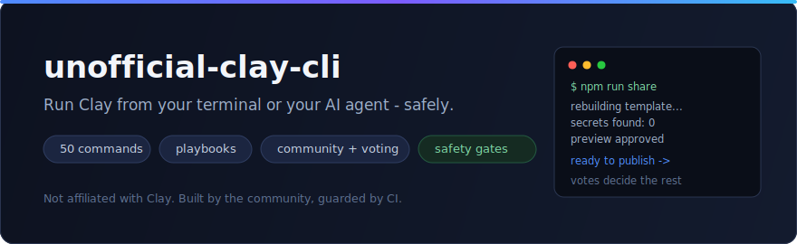
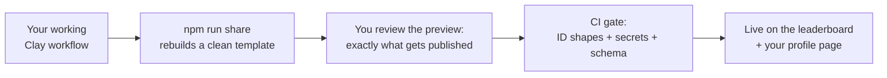

<div align="center">



[](LICENSE)
[](package.json)
[](.claude/skills/)
[](SECURITY.md)

**[Get started](#get-running-in-2-minutes)** · **[Top workflows](#top-community-workflows)** · **[Share yours](CONTRIBUTING.md)** · **[Safety](SECURITY.md)**

</div>

## What can you do with it?

<table>
<tr>
<td width="33%" valign="top">

### Drive Clay from your terminal

Tables, fields, enrichment runs, people/company sources, full workbook exports - 50 commands, every write behind a dry-run and a confirm gate.

```bash
node clay-api.js workspaces
```

</td>
<td width="33%" valign="top">

### Let your AI agent do it

10 Claude Code skills turn plain English into safe Clay operations - "build me an email waterfall table" becomes validated specs and 10-row test runs.

```text
> use the clay-onboarding skill
```

</td>
<td width="33%" valign="top">

### Use proven workflows

Install workflow templates the community has already battle-tested. Vote for the best ones. Share your own and get your name on the board.

```bash
npm run share
```

</td>
</tr>
</table>

## Top community workflows

<!-- LEADERBOARD:START -->
| # | Workflow | Category | Author | Votes |
|---|----------|----------|--------|-------|
| 1 | [Work Email Waterfall](community/templates/work-email-waterfall/) | `enrichment` | [Matt Sezgin](community/contributors/MattSezgin/) | 0 votes |

*Vote with a thumbs-up on a workflow's discussion thread. Updated automatically.*
<!-- LEADERBOARD:END -->

Your workflow could be #1. **[Share one in ~5 minutes](CONTRIBUTING.md)** - a wizard rebuilds it as a clean template (your secrets physically cannot come along), you get a **[contributor profile](community/contributors/MattSezgin/)** with your name, company, and LinkedIn, and every thumbs-up moves you up this board.

## Get running in 2 minutes

```bash
git clone https://github.com/MattSezgin/unofficial-clay-cli.git && cd unofficial-clay-cli
npm install                     # one dependency, under a second

cp .env.example .env            # add CLAY_EMAIL + CLAY_PASSWORD (mints a local session)
export CLAY_WORKSPACE_ID=123456 # the number in your Clay app URL
export CLAY_FOLDER_ID=f_TEST_FOLDER   # optional: sandbox all writes to one folder

node clay-api.js workspaces     # read-only, zero credits - proves it works
```

Using an AI agent? Open the repo and say *"run the clay-onboarding skill"* - it walks everything interactively.

## How sharing stays leak-proof

People paste API keys into Clay HTTP columns. Table exports carry contact data. Webhook URLs are passwords. This repo assumes all of that and makes leaking *structurally* hard:



- Templates are strict forms - **there is no field a secret fits in**
- The wizard **rebuilds, never copies** - raw column config (where keys hide) never leaves your machine
- CI bans the very **shape** of real Clay IDs and scans every push with two independent secret scanners
- Your session file lives **outside the repo folder** - it cannot be committed, even by accident

The full threat model and the rotate-first incident playbook: **[SECURITY.md](SECURITY.md)**.

## The safety model for live runs

The tool can spend your credits and write to your tables, so it is paranoid by default: every write needs `--confirm` after a dry-run, enrichment runs are capped at 10 rows until you have verified quality (`run-top --n 10`), and writes are refused outside the workspace/folder you configured (`CLAY_WORKSPACE_ID` / `CLAY_FOLDER_ID` / `CLAY_WRITE_SCOPES`).

<details>
<summary><b>The 10 Claude Code skills</b></summary>

<br>

| Skill | Use it to |
|-------|-----------|
| `clay-onboarding` | Set up auth, workspace scope, and your first read-only command |
| `clay-explore` | Explore workspaces, tables, credits, and schemas - read-only |
| `clay-build-table` | Build tables declaratively with spec validate/diff/apply |
| `clay-build-lists` | Build people/company lists and webhook sources |
| `clay-run-enrichment` | Run enrichments on 10-row samples and verify output quality |
| `clay-run-playbook` | Drive the full plan -> sample -> scale lifecycle |
| `clay-browse-actions` | Discover and evaluate 40 cataloged Clay actions |
| `clay-export` | Export full workbooks safely |
| `clay-share-workflow` | Share a workflow to the community leaderboard |
| `clay-security-guide` | Learn the leak vectors and how to respond to incidents |

</details>

<details>
<summary><b>What's in the box</b></summary>

<br>

| Piece | Where | What it does |
|-------|-------|--------------|
| Main CLI | `clay-v2.js` | Tables, fields, views, records, sources, enrichment runs, declarative specs - `node clay-v2.js help` |
| Lightweight client | `clay-api.js` | 35 quick read/write commands + a require-able `ClayAPI` class |
| Full exporter | `scripts/full_export.py` | Every row of every table in a workbook, including full AI/action column payloads |
| Playbook engine | `lib/` | A disciplined operator loop: plan offline, confirm one live command at a time, verify with evidence |
| Integration library | `integration-library/` | 40 Clay actions with observed input bindings, statuses, and battle-test verdicts |
| Community | `community/` | Workflow templates + contributor profiles + the leaderboard |
| Safety tooling | `scripts/scan-repo.js`, `scripts/validate-community.js` | The gates that keep secrets and real IDs out - run locally any time |
| Table snapshots | `npm run snapshot -- <tableId>` | Render any table's state as a clean HTML page (`--redacted` for shareable structure reviews) |

*Vocabulary, once: a **playbook** is a step-by-step recipe for building a Clay table. A **spec** is the YAML description of a table - a blueprint you can validate before building. A **readback** is a fresh read from Clay after a change - the readback is the truth, not the command output. Config: bare env vars work everywhere; the playbook engine can also read named profiles - copy `config.example.yaml` and see the operator runbook in `docs/`.*

</details>

<details>
<summary><b>Live-behavior notes and current limits</b> (enforced by the test suite so docs cannot drift from code)</summary>

<br>

- **Webhook Sources**: `create-webhook-source` adds a webhook source to a table. Duplicate webhook sources are refused unless you explicitly pass `--allow-duplicate-webhook`.
- **Real Workbook Parity Fixtures**: `workbook-fixture` extracts a redacted manifest from a known-good workbook; `workbook-export` captures full structure. Parity checks compare functional structure, not just row counts.
- **Workspace onboarding**: `onboard-workspace` inventories the actions observed in your workbooks and can update `integration-library/registry.yaml` with `--update-library`.
- **Select cell writes are not supported yet** by the verified records API path - `--allow-select-write` exists only for live probes and can produce phantom values; avoid it in production flows.
- **View sort/filter updates are not supported yet** - configure sorts/filters in the Clay UI.
- Field and status readbacks can show internal names (`api=...`) that differ from the labels you see in the Clay UI - always trust the readback.
- **Primitive source/import proof is not the same as a real Clay workbook** - a command succeeding once is not evidence your production table is configured correctly. Verify with live readback (see the playbook lifecycle).

</details>

---

<div align="center">

**Built and maintained by [Matt Sezgin](https://www.linkedin.com/in/mattsezgin/)** · MIT License

*Not affiliated with or endorsed by Clay. This toolkit talks to Clay's internal v3 API and can break when Clay changes things.*

</div>
